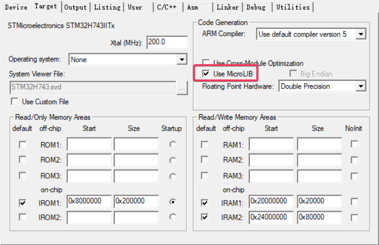

1. 使用串口重定向后，脱机无法工作

   ```c
   int fputc(int ch, FILE *f)
   {
   	HAL_UART_Transmit(&huart3, (uint8_t *)&ch, 1, HAL_MAX_DELAY);
   	return ch;
   }
   
   int fgetc(FILE *f)
   {
   	uint8_t ch = 0;
   	HAL_UART_Receive(&huart3, &ch, 1, HAL_MAX_DELAY);
   	return ch;
   }
   ```

   **解决：✔Use MicroLIB**

​										

2. 使用`HAL_UARTEx_ReceiveToIdle_DMA`接收数据，在`osKernelInitialize`处会卡死

   暂未解决

3. STM32中UART和USART以及LPUART的异同

   在STM32中，UART、USART和LPUART都是用来实现串口通信的接口。

   UART (Universal Asynchronous Receiver/Transmitter) 是一种**异步**串行通信协议，它使用一个固定的波特率和一个起始位和停止位来区分每个字节。STM32中的UART支持无奇偶校验位和一个停止位，具有简单、可靠、对噪声不敏感等特点。

   USART (Universal Synchronous/Asynchronous Receiver/Transmitter)是一种同时支持**同步和异步**通信的通信协议。它不仅可以像UART一样进行异步通信，还可以通过同步模式和其他设备建立同步连接。

   LPUART (Low-Power Universal Asynchronous Receiver/Transmitter)是一种**低功耗的异步串行**通信协议。与UART和USART相比，LPUART通常在低频率（低于1Mbps）串行通信中使用，有着更高的功率效率，可以在低功耗模式下运行。

   总体而言，这三种串口通信接口的主要区别在于它们特定的应用场景和数据传输的特性，具有不同的功能和优势。用户可以根据具体的应用需求来选择具体的串口通信接口。